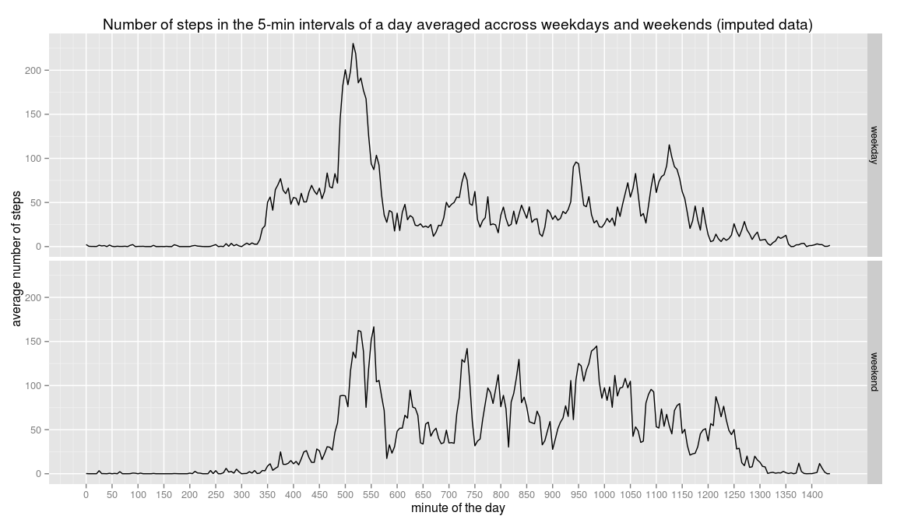

## Reproducible Research: Peer Assessment 1

### Loading and preprocessing the data

* Unzip database "Active Monitoring Data" and load it into the R object "db"

```r
setwd("~/RepData_PeerAssessment1")
unzip("activity.zip")
db <- read.csv("activity.csv", na.strings = "NA")
```

* Check the db structure and change class of var "date" and "interval"

```r
str(db)
```

```
## 'data.frame':	17568 obs. of  3 variables:
##  $ steps   : int  NA NA NA NA NA NA NA NA NA NA ...
##  $ date    : Factor w/ 61 levels "2012-10-01","2012-10-02",..: 1 1 1 1 1 1 1 1 1 1 ...
##  $ interval: int  0 5 10 15 20 25 30 35 40 45 ...
```

```r
db$date <- as.Date(db$date, format = "%Y-%m-%d")
db$interval <- as.factor(db$interval)
```


### What is mean total number of steps taken per day?

* Creating a histogram of the total number of steps taken each day


```r
a <- aggregate(db$steps, by = list(Date = db$date), FUN = "sum")
hist(a$x, main = "Histogram of total steps taken on average each day", xlab = "total number of steps")
```

 


* Calculate the mean and median of the total number of steps taken per day

```r
avstday <- round(mean(a$x, na.rm = T), 0)
mestday <- round(median(a$x, na.rm = T), 0)
```

The __mean__ of steps taken per day is __10766__   

The __median__ of steps taken per day is __10765__


### What is the average daily activity pattern?

* Create a plot of the number of steps accross the 5-min intervals of a day averaged accross all days

```r
b <- aggregate(steps ~ interval, FUN = "mean", data = db)
b$daymin <- as.integer(seq(0,1435,by=5)) 
plot(b$daymin, b$steps, type = "l", ylab = "average number of steps", xlab = "day minute", main = "Number of steps in the 5-min intervals of a day averaged accross days")
```

 


The interval __835__ (515^ minute of the day), on average across all the days in the dataset, contains the maximum number of steps (__206__) 


### Imputing missing values

* Calculate and report the total number of missing values in the dataset

```r
NAsteps <- sum(is.na(db$steps)*1)
NAdate <- sum(is.na(db$date)*1)
NAinterval <- sum(is.na(db$interval)*1)
```

__Missing values__ of the var __"steps"__ are: __2304__       

__Missing values__ of the var __"date"__ are: __0__      

__Missing values__ of the var __"interval"__ are: __0__       


* Impute missing values of the var "steps" with the corresponding 5-min interval averaged accross all days

```r
repsteps <- rep(b$steps,61)
stepsnew = NULL
for (i in 1:17568) {
       if (is.na(db$steps[i])) {
               stepsnew[i] = round(repsteps[i],0)
       } else {
               stepsnew[i] = db$steps[i]
       }
               
}
db1 <- cbind(db,stepsnew)
```


* Make a histogram of the total number of steps taken each day with imputed dataset

```r
c <- aggregate(db1$stepsnew, by = list(Date = db$date), FUN = "sum")
hist(c$x, main = "Histogram of total steps taken on average each day (imputed dataset)", xlab = "total number of steps")
```

 


* Calculate the mean and median of the total number of steps taken per day with imputed dataset

```r
avstdaynew <- round(mean(c$x), 0)
mestdaynew <- round(median(c$x), 0)
```


The __mean__ of steps taken per day is __10766__   

The __median__ of steps taken per day is __10762__

Mean and median values __do not differ__ between imputed and not imputed dataset

Imputing missing values __does not affect__ the estimates of the total daily number of steps 


### Are there differences in activity patterns between weekdays and weekends?

* Create the factor variable "wend" to define weekday and weekend days

```r
db1$wend = NULL
for (i in 1:17568) {
       if (weekdays(db1$date[i])=="Saturday" | weekdays(db1$date[i])=="Sunday") {
        db1$wend[i] = 1
        } else {
                db1$wend[i] = 0
        }
}
db1$wend <- as.factor(db1$wend)
levels(db1$wend) <- c("weekday","weekend")
```

* Creating a panel plot containing the time series plot of the 5-min interval (x-axis) and the average number of steps taken, averaged across all weekday days or weekend days (y-axis) with the imputed dataset

```r
library(ggplot2)
d <- aggregate(stepsnew ~ interval, FUN = "mean", data = db1[db1$wend == "weekday",])
e <- aggregate(stepsnew ~ interval, FUN = "mean", data = db1[db1$wend == "weekend",])
db2 <- rbind(d,e)
db2$wend <- factor(c(rep(0,288),rep(1,288)))
levels(db2$wend) <- c("weekday", "weekend")
db2$daymin <- as.integer(rep(seq(0,1435,by=5),2))
x <-qplot(daymin,stepsnew, data = db2, facets = wend~., geom = "line",xlab = "minute of the day", ylab = "average number of steps", main = "Number of steps in the 5-min intervals of a day averaged accross weekdays and weekends (imputed data)")
x + scale_x_continuous(breaks=seq(0,1435,by=50))
```

 
